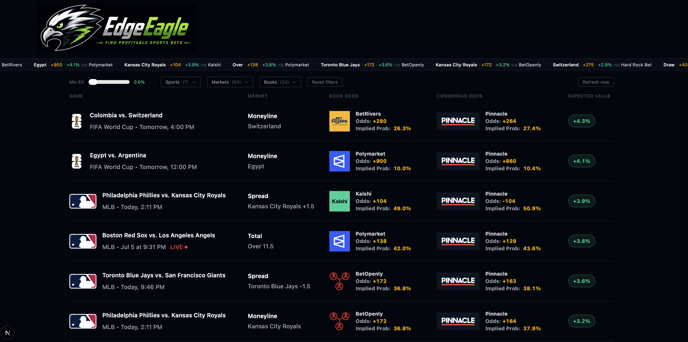
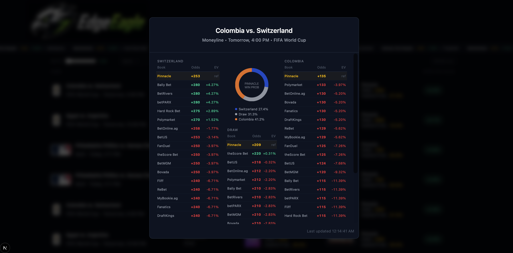

# 🦅 EdgeEagle

**Real-time +EV sports betting finder powered by Pinnacle sharp lines.**

EdgeEagle identifies positive expected value betting opportunities by comparing sportsbook odds against Pinnacle's devigged probability — the sharpest reference line available in the market. Instead of guessing which bets are good, EdgeEagle does the math.

<p>
  
  
</p>

---

## What is +EV betting?

Every sportsbook builds a margin (the "vig") into their odds. Strip that margin away and you get the **true probability** of an outcome. When a book offers odds that imply a *lower* probability than the true probability, that's a positive expected value (+EV) bet — statistically, you'll profit over time.

The challenge: finding the true probability. EdgeEagle uses **Pinnacle** — the world's sharpest sportsbook, known for accepting professional bettors and maintaining the most efficient lines in the market — as the reference. Pinnacle's devigged odds are the closest thing to true market probability available publicly.

---

## How it works

### 1. Fetch
EdgeEagle pulls odds from two sources simultaneously per sport:
- **Pinnacle** (EU region) — the sharp reference line
- **US books + exchanges** (DraftKings, Fanduel, Kalshi, Polymarket, and others) — where value gets found

### 2. Merge
Events are matched by ID and merged so every game has both Pinnacle's sharp line and all US book lines in one place.

### 3. Devig
Pinnacle's vig (~1-2%, the lowest in the industry) is stripped using normalization:

```
fair_prob = implied_prob / sum_of_all_implied_probs
```

This gives the true underlying probability for each outcome.

### 4. EV Calculation
For every outcome on every US book, EV is calculated against Pinnacle's fair probability:

```
EV = (true_prob × potential_profit) - (1 - true_prob)
```

Positive EV = the book is offering better odds than the market says it should.

### 5. Consensus fallback
For markets where Pinnacle doesn't have lines (some period markets, soccer halves), EdgeEagle builds a **median consensus** from all available books — each devigged individually, then the median taken to filter out stale outliers.

---

## Features

- **Multi-market support** — Moneyline, spreads, totals, and period markets (halves, quarters, innings, periods)
- **Live game tracking** — LIVE badge and current score on in-progress games
- **Game detail modal** — Click any bet to see every book's line side-by-side, color-coded by EV, with a Pinnacle win probability pie chart
- **Smart filters** — Filter by sport, book, market type, and minimum EV threshold
- **Scrolling ticker** — Top value bets displayed in a live ticker bar
- **Reference type labeling** — Bets show whether EV was calculated vs Pinnacle or median consensus, so you always know the confidence level

---

## Tech stack

- **Next.js 16** (App Router) with TypeScript
- **Tailwind CSS v4**
- **The Odds API** for odds and scores data
- Server-side API routes for odds fetching, EV calculation, and score merging

---

## Architecture decisions

**Pinnacle-first devigging** — Rather than building a weighted consensus across all books, EdgeEagle uses Pinnacle exclusively as the sharp reference. This is the industry standard approach used by professional bettors: Pinnacle's lines are moved by sharp action, making them the most accurate publicly available probability estimate.

**Point-value matching for spreads and totals** — When comparing spread lines across books, EdgeEagle matches not just by team name but by the exact point value. This prevents false positives where Pinnacle's -1.5 line gets compared against a book's +1.5 line — a completely different bet.

**Median over mean for consensus** — When building a consensus probability from multiple books, EdgeEagle takes the median rather than the mean. Prediction markets and exchanges can have stale lines that would drag a mean significantly — the median is robust to these outliers.

**Provider abstraction** — The odds fetching layer is designed so the data provider can be swapped without touching the EV calculation logic. `PINNACLE_MARKETS` and `SPORT_MARKETS` are configured separately per sport so Pinnacle is only queried for markets it actually covers, avoiding wasted API credits.

---

## Sports coverage

| Sport | Markets |
|-------|---------|
| MLB | Moneyline, Spread, Total |
| NFL | Moneyline, Spread, Total, Halves, Quarters |
| NBA | Moneyline, Spread, Total, Halves, Quarters |
| NHL | Moneyline, Spread, Total, Periods |
| WNBA | Moneyline, Spread, Total, Halves, Quarters |
| NCAAF | Moneyline, Spread, Total, Halves, Quarters |
| FIFA World Cup | Moneyline, Spread, Total |

---

## Books tracked

Kalshi · Novig · Polymarket · ProphetX · DraftKings · FanDuel · BetMGM · BetRivers · BetOnline · Bovada · Hard Rock Bet · ESPN Bet · Fliff · BetOpenly · and more

---

## Known Limitations

**Live betting accuracy** — EV calculations on live games are unreliable. Pinnacle updates lines within seconds of game events; prediction markets like Kalshi and Polymarket update only when users submit new orders. A 20% EV on a live game almost always means one book hasn't caught up yet, not a real edge. Additionally,  

**Budget tier polling frequency** - The Odds API's lower tiers offer a limited amount of credits/month. Refreshing can quickly become costly: each refresh costs # of markets × # of sports × # of books + live score tracking. Meaningful real-time polling requires an expensive paid plan.

**Alternate line not supported** - When books offer different point values for the same game, it can be hard to calculate EV odds due to a lack of consistency. Not currently implemented.

**Player props not supported** - Props require a separate per-event API endpoint, making them expensive to fetch at scale. Not currently implemented.

**No closing line value (CLV)** — EdgeEagle shows current EV but doesn't track whether lines moved in your favor after you identified them. CLV is how serious bettors validate their edge over time.

**Arbitrage betting not support** - EdgeEagle focuses on +EV betting against sharp lines rather than cross-book arbitrage. True arbitrage opportunities (guaranteed profit regardless of outcome) are rare, close within seconds, and require real-time streaming data beyond what REST polling can support. 
